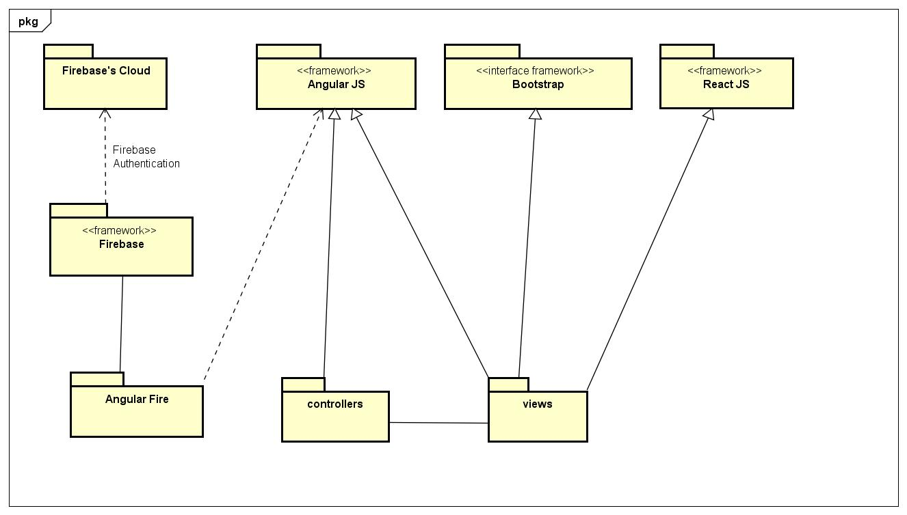
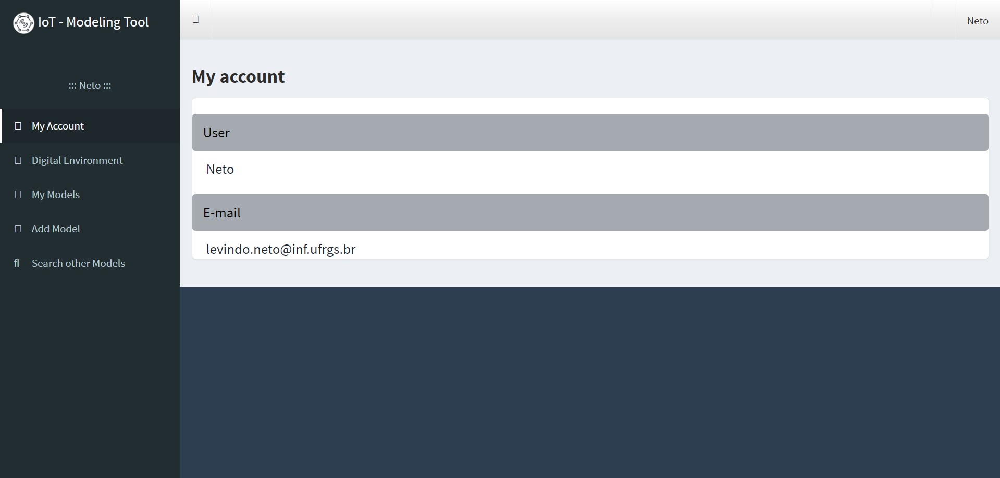
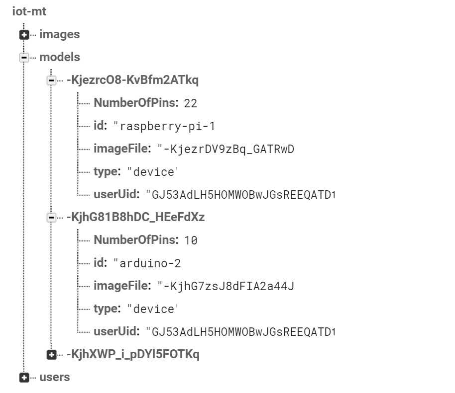

# IoT - Modeling Tool

Iot Modelling Tool is a platform which allows users to have their own devices and components modeled in order to represent a physical environment.


__Author__

[Levindo Gabriel Taschetto Neto (IPVS)](http://levindoneto.com)

__Advisors__

[Prof. Dr.-Ing. habil. Bernhard Mitschang (IPVS)](https://www.ipvs.uni-stuttgart.de/abteilungen/as/abteilung/mitarbeiter/bernhard.mitschang)

[M.Sc. Ana Cristina Franco da Silva (IPVS)](https://www.ipvs.uni-stuttgart.de/abteilungen/as/abteilung/mitarbeiter/Ana.Franco)

[Dipl.-Inf. Pascal Hirmer (IPVS)](https://www.ipvs.uni-stuttgart.de/abteilungen/as/abteilung/mitarbeiter/Pascal.Hirmer)


## Repository Structure

* [App](public/app) (contains the files assigned to organize the high-level architecture of the project)

* [CSS Files](public/css) (contains the style files for the front-end, e.g., bootstrap files)

* [Images](public/img) (contains the images used in the project, e.g., devices, sensors and actuators icons)

* [Javascript Files](public/js) (contains files responsible for the back-end of the project, e.g., AngularJS files)

* [Plugins](public/plugins) (contains files responsible for add specifics features to the back-end of the project)

* [Resources](public/resources) (contains the diagrams of the project, e.g., astah files)

## Relationship among the packages in a high level approach

The packages diagram can be viewed in the image bellow.



The system currently can be seen in the picture bellow.



Also the format of the database is as following:



## How it will work (Initial idea)

I) When an item is drag and dropped in the virtual environment (digital twin) an item is created in the database.
This item has a random ID (Key in the JSON representation).
The values assigned to each key might be:

* Type (sensor, device, actuator) [String]
* Name [String]
* MAC Address [Integer]
* Available connections (in case of the devices this can be sensors, actuators, etc.) [List]
* Connections [List]
* Location (longitudinal, latitudinal)

II) When an item is drag and dropped into the trash icon it'll be removed from the virtual environment and it'll be deleted from the database.

## Utilized technologies

### Front-End

* HTML v5
* CSS v3
* [Bootstrap v3.3.7](http://getbootstrap.com/)
* [React JS v15.5.4](https://facebook.github.io/react/)

### Back-End

* [Angular JS](https://angularjs.org/)

### Database

* [Firebase](https://firebase.google.com) on Google's cloud

### Utilized frameworks

* [AngularFire v2.3.0](https://github.com/firebase/angularfire)
* [ReactFire v1.0.0](https://github.com/firebase/reactfire)

### Linter

* [ESLint v4.1.1](https://marketplace.visualstudio.com/items?itemName=dbaeumer.vscode-eslint)

## Setup IoT Modeling Tool

### On windows

#### Install NodeJS

* [Download the installer](https://nodejs.org/en/download/)
* Install NodeJS
* Restart the machine

##### Simple commands to test NodeJS

###### Test Node
```terminal
$ node -v
```

###### Test NPM
```terminal
$ npm -v
```

###### Run a file (file.js)
```terminal
$ node file.js
```

##### Install Bower
```terminal
$ npm install -g bower
```

###### Init Bower inside the project folder
```terminal
$ bower init
```

###### The configurations in a JSON format should be like this
```json
{
  name: 'IoT-MT',
  authors: [
    'Levindo Neto <levindogtn@gmail.com>'
  ],
  description: 'Modeling Tool',
  main: 'index.html',
  keywords: [
    'iot'
  ],
  license: 'MIT',
  homepage: '',
  ignore: [
    '**/.*',
    'node_modules',
    'bower_components',
    'test',
    'tests'
  ]
}
```

###### Bind Bower and Angular JS
```terminal
bower install --save angular
```

##### Install the frameworks

TODO

###### AngularFire

TODO

##### ReactFire

TODO

##### Set-up the database

TODO

##### Server for tests

For tests can be used the [http-server](https://www.npmjs.com/package/http-server)
The installation can be done with NPM
```terminal
$ npm install -g http-server
```

or can be used Python Server (It's compatible with [font awesome](https://fontawesome.io))
```terminal
$ python -m http.server [<portNo>]  // Windows
```

```terminal
$ python -m SimpleHTTPServer  // Linux
```

###### To access the application can be used link
```terminal
http://localhost:[<portNo>]/
```
directly in any web browser.

##### Setup the directory for express
```terminal
$ npm install -g express-generator
$ express Implementierung
$ npm install -d
$ npm start
```

Another way to start the application in the browser is with the Zervit.

Also it should be added on [package.json](public/package.json) in "scripts":
```json
"start": "http-server ./Implementierung -a localhost -p 8080"
```
